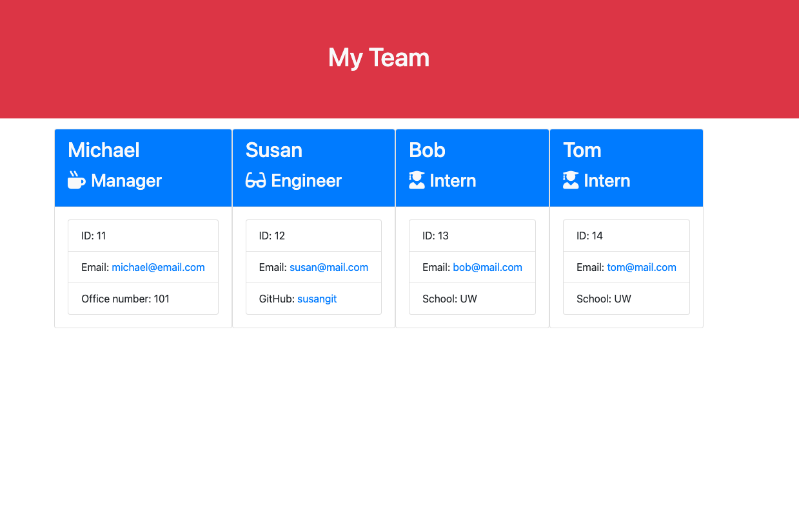

# Team Profile Generator 


## Description
This is a node.js project generates tam profile page by taking inputs from user through command line.
<br /> 

## Table of Contents 
* [User Story](#userstory)
* [Installation](#installation)
* [Usage](#usage)
* [Contributing](#contributing)
* [Tests](#tests)
* [License](#license)

<br /> 
<br /> 

You can find the video of the app that shows functionality [here](./images/team-generator.webm) 




<br /> 

## User Story
```
As a manager
I want to generate a webpage that displays my team's basic info
so that I have quick access to emails and GitHub profiles
```


## Installation
The following  dependencies must be installed to run the application: 
dependencies: inquirer
devDependencies: jest
<br /> 
<br /> 

## Usage
​​This application is used for generating a team profile page.

## License
This project is license under the MIT license.

## Contributing
​Contributors: Ali Demir

## Tests
To run tests, you need to run the following command:
 node test

<br /> 

My GitHub username: [alidemirbay](https://github.com/alidemirbay)
<br />
You can ask your questions at: alidemirbay@gmail.com